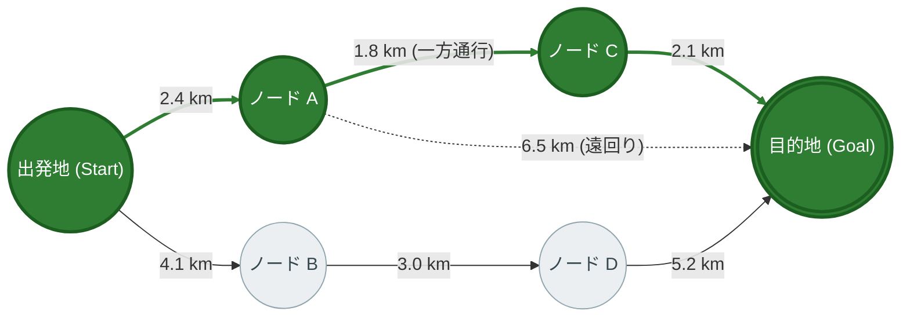
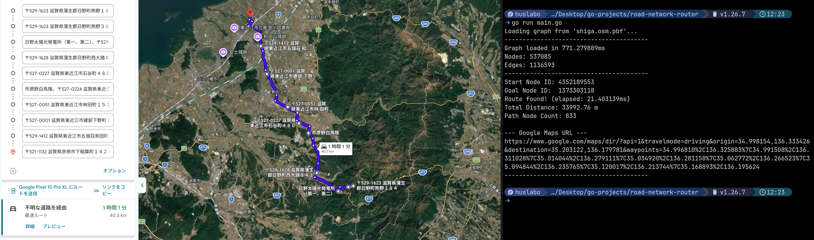

# Road Network Router

[](https://go.dev/)
[](LICENSE)

**OpenStreetMap (PBF形式)** の実世界道路網データから有向グラフを構築し、**A\*（A-Star）探索アルゴリズム** を用いて最短経路探索および Google Maps ナビゲーション連携を行う、Go言語製のルーティングエンジンです。

---

## 開発の背景と目的

コンピュータネットワークやグラフ理論における**「最短経路ルーティング」の仕組み（有向グラフ、コスト計算、探索の停止性）を深く探求・検証すること**を出発点として開発しました。

教科書的な小規模グラフにとどまらず、実世界の巨大な空間ネットワーク（**滋賀県全域：約53万ノード・113万エッジ**）を対象とし、以下の実践的・工学的な課題に取り組んでいます。

1. **実世界の交通法規を反映した有向グラフ設計**:
   - 一方通行（`oneway` タグ）や高速道路・環状交差点の暗黙的一方通行ルールを正しくモデリング。
2. **幾何学的ヒューリスティックによる高速化**:
   - 2地点間の球面大圏距離（Haversine式）を許容的ヒューリスティック関数として採用し、A* 探索による探索空間の大幅削減を実現。
3. **大容量 PBF データのストリーミング処理**:
   - バイナリ形式の OSM PBF データをストリーミング走査し、メモリ効率よく自動車通行可能道路のみを抽出。
4. **外部サービス連携（Google Maps ナビURL生成）**:
   - 得られた数千ノードの経路から Google Maps の経由地制限（最大8地点）に合わせて最適サンプリングを行い、実機で走行可能なナビURLを自動生成。

---

## 最短経路探索のネットワーク構造



> **探索結果（緑色ハイライト）**: $\text{出発地} \rightarrow \text{ノード A} \rightarrow \text{ノード C} \rightarrow \text{目的地}$ （総距離: 6.3 km）  
> 優先度付きキューによる $f(n) = g(n) + h(n)$ の評価により、目的地方向から外れる枝（ノードB・D方面）を早期に除外します。

---

## ディレクトリ構成と設計方針

責務ごとにパッケージを疎結合に分離し、保守性とテスタビリティを高めた構成にしています。

```text
road-network-router/
├── main.go               # エントリポイント（パイプラインの組み立て・実行）
├── engine/
│   └── astar.go          # A* 探索アルゴリズム・経路復元ロジック
├── geo/
│   └── distance.go       # Haversine 球面大圏距離計算
├── osm/
│   └── parser.go         # PBFストリーミング読み込み・道路抽出・有向グラフ構築
├── queue/
│   └── pq.go             # container/heap を満たす最小ヒープ（PriorityQueue）
├── types/
│   └── models.go         # 共通データ構造（Coordinate, Edge, Graph, RouteResult）
└── googlemaps/
    └── url.go            # 経由地間引きサンプリング & Google Maps ナビURL生成
```

### 各パッケージの責務

| パッケージ | 責務・役割 |
| :--- | :--- |
| **`osm`** | PBF データをストリーミング走査し、車道（`highway`）および一方通行（`oneway`）判定を行って有向グラフを構築する。 |
| **`geo`** | 2点の緯度経度からメートル単位の幾何学的最短距離（大圏距離）を算出する。 |
| **`queue`** | `container/heap.Interface` を満たす最小ヒープを実装し、$O(\log V)$ での最小コストノード取得を提供する。 |
| **`engine`** | 構築されたグラフ上で A* 探索を実行し、ゴール到達後にバックトラックして通過ノード列を復元する。 |
| **`googlemaps`** | 探索結果のノード列から等間隔に経由地をサンプリングし、Google Maps 連携用の URL を生成する。 |

---

## パフォーマンス測定結果

**滋賀県全域データ（`shiga.osm.pbf` / 約30MB）** を使用した実測ベンチマーク：

| 測定項目 | 実測値 | 備考 |
| :--- | :--- | :--- |
| **グラフ構築時間** | **約 950 ms** | 1秒未満で全道路網を有向グラフ化 |
| **グラフノード数 ($V$)** | **537,085 ノード** | 車道交差点・接続点 |
| **総エッジ数 ($E$)** | **1,136,593 エッジ** | 一方通行を考慮した有向リンク |
| **経路探索時間** | **約 1 〜 100 ms** | 探索距離に応じて高速に応答 |
| **メモリ使用量** | **約 120 MB** | PBFストリーミング処理により低メモリ消費 |

---

## 動作環境・実行手順

### 前提環境
- [Go](https://go.dev/) 1.22 以上
- OSM PBF データファイル（例: [Geofabrik 日本データ](https://download.geofabrik.de/asia/japan.html) からダウンロード）

### 実行方法

1. リポジトリをクローン:
   ```bash
   git clone https://github.com/yoshinori-i-infra/road-network-router.git
   cd road-network-router
   ```

2. PBF ファイル（例: `shiga.osm.pbf`）をプロジェクト直下に配置。

3. プログラムを実行:
   ```bash
   go run main.go
   ```

### 実行結果例

```text
Loading graph from 'shiga.osm.pbf'...
----------------------------------------
Graph loaded in 948.962831ms
Nodes: 537085
Edges: 1136593
----------------------------------------
Start Node ID: 12751622407
Goal Node ID:  1353599761
Route found! (elapsed: 109.414013ms)
Total Distance: 56404.35 m
Path Node Count: 1190

--- Google Maps URL ---
https://www.google.com/maps/dir/?api=1&travelmode=driving&origin=35.288002,136.252562&destination=35.236279,135.952289&waypoints=35.261183%2C136.213761%7C35.232054%2C136.159224%7C35.195320%2C136.097247%7C35.144207%2C136.060302%7C35.127637%2C135.995789%7C35.118912%2C135.943173%7C35.157411%2C135.924840%7C35.200383%2C135.922109
----------------------------------------
```
                                                                    

---

## ライセンス

本プロジェクトは [MIT License](LICENSE) の下で公開されています。
